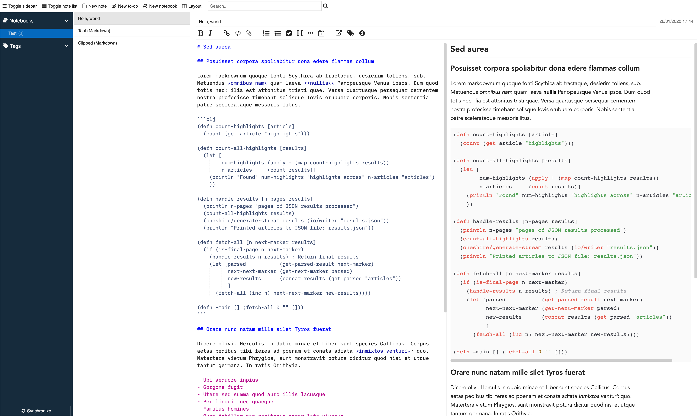

# Devon's custom styles for Joplin

[Joplin](https://joplinapp.org) is an open source note taking app. You can create custom styles for the app itself as well as for the rendered Markdown preview pane.

I've started to make little visual tweaks, which I figured I'd share in case others have similar visual taste as me.

I'll continue to evolve these styles over time. Right now, the primary change is just the typography of the app, but ultimately I intend to do a fuller redesign to make the app more sleek. If what I make is good, I'll consider trying to merge it into the main project, but for starters I'll just leave it in these custom files.

**Before:**

**After:**
